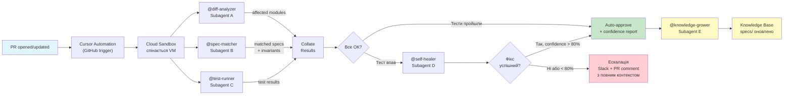
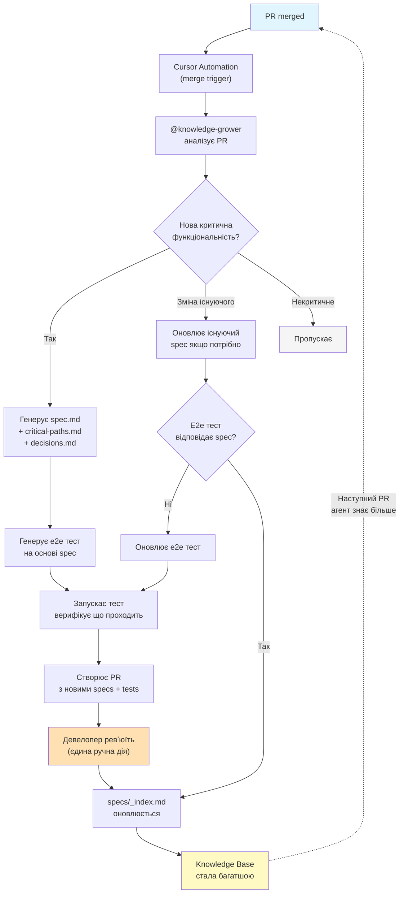
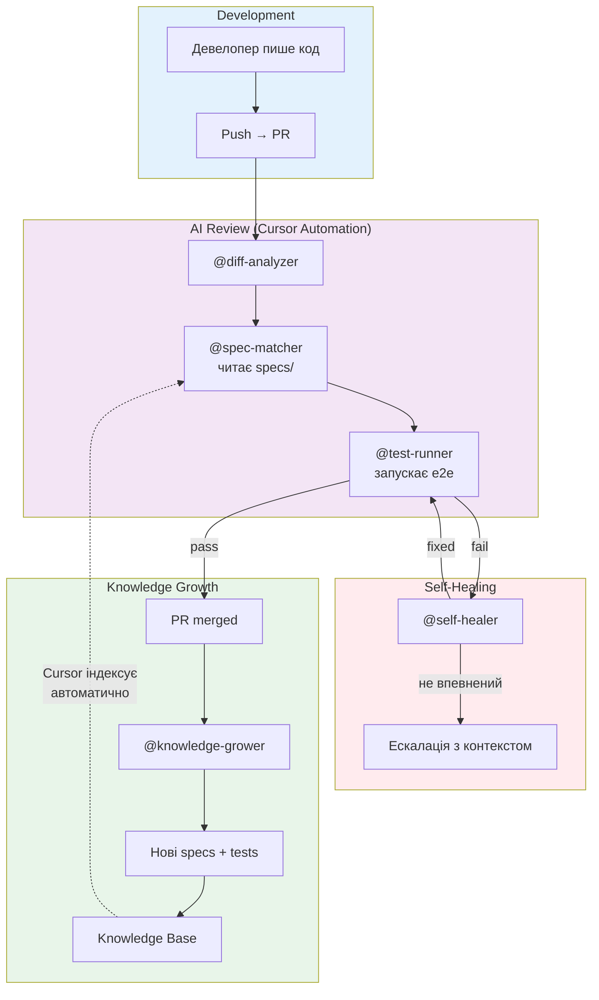

# Self-Healing AI-Driven SDLC

## Концепція

Репозиторій = єдине source of truth: код + специфікації + e2e тести + історія рішень.
AI-агент (Cursor Automations + Subagents + Skills) автономно підтримує якість кожної зміни.
Команда фокусується на продукті, а не на регресії.

**Ключова ідея: система наповнює себе сама.** Кожна нова фіча, кожен merged PR автоматично збагачує knowledge base — специфікації, критичні шляхи, e2e тести. Людина тільки апрувить або корегує. З часом агент стає впевненішим, бо база знань росте органічно.

---

## Архітектура: PR Review Flow



## Архітектура: Self-Growing Knowledge Base



## Архітектура: Повний цикл Self-Healing SDLC



---

## Структура репо

```
repo/
├── AGENTS.md                         # Головні інструкції для агента
│
├── .cursor-plugin/
│   └── marketplace.json              # Cursor team marketplace manifest
│
├── plugins/
│   └── ai-sdlc/                      # Cursor plugin (42flows.tech)
│       ├── .cursor-plugin/plugin.json
│       ├── agents/                   # Custom Subagents (@name)
│       │   ├── diff-analyzer.md
│       │   ├── spec-matcher.md
│       │   ├── test-runner.md
│       │   ├── self-healer.md
│       │   └── knowledge-grower.md   # ключовий!
│       ├── skills/                   # Agent Skills (on-demand)
│       │   ├── spec-generator/SKILL.md
│       │   ├── e2e-generator/SKILL.md
│       │   ├── criticality-classifier/SKILL.md
│       │   └── kb-indexer/SKILL.md
│       ├── rules/                    # Static rules (always-on context)
│       │   ├── ai-sdlc-core.mdc
│       │   ├── specs-conventions.mdc
│       │   └── test-conventions.mdc
│       └── commands/
│           └── bootstrap-ai-sdlc.md
│
├── specs/                            # Living Knowledge Base (SELF-GROWING)
│   ├── _index.md                     # автогенерований реєстр модулів
│   ├── _coverage.md                  # автогенерований звіт покриття
│   ├── payments/
│   │   ├── spec.md                   # специфікація (invariants, flows)
│   │   ├── decisions.md              # ADR: чому саме так
│   │   └── critical-paths.md         # критичні шляхи
│   ├── auth/
│   │   └── ...
│   └── loyalty/
│       └── ...
│
├── e2e/                              # E2E тести (привʼязані до спеків)
│   ├── payments/
│   │   └── payment-flow.spec.ts      # header: spec-ref: specs/payments
│   └── ...
│
└── .github/
    └── workflows/
        └── cursor-webhook.yml        # webhook для Cursor Automations
```

---

## Конфігурація Cursor

### AGENTS.md (root)

```markdown
# Project Agent Instructions

## Identity
You are an AI engineering agent for [Project Name].
Your primary mission: maintain quality of critical functionality autonomously.

## Knowledge Base
- specs/ contains living specifications of critical modules
- specs/_index.md is the registry — ALWAYS check it first
- Each spec has invariants that MUST NOT be violated
- e2e/ tests are linked to specs via `spec-ref` header

## Workflow: PR Review
1. On PR open/update — invoke @diff-analyzer, @spec-matcher, @test-runner in parallel
2. If tests fail — invoke @self-healer (max 3 attempts)
3. If self-heal fails or confidence < 80% — escalate with full context
4. On PR merge — invoke @knowledge-grower to expand knowledge base

## Workflow: Knowledge Growth  
Every merged PR MUST be analyzed for knowledge base expansion.
The @knowledge-grower agent decides if specs need creating/updating.
This is the MOST IMPORTANT workflow — it makes the system smarter over time.

## Escalation
- ALWAYS include: what changed, what broke, what spec is at risk, what you tried
- NEVER guess — if confidence < 80%, escalate
- Tag spec owners from spec.md frontmatter

## Conventions
- TypeScript, Playwright for e2e, Vitest for unit
- All critical modules MUST have specs in specs/
- PR without passing e2e for affected critical modules = blocked
```

### plugins/ai-sdlc/agents/diff-analyzer.md

```markdown
---
name: diff-analyzer
description: Analyzes PR diffs, classifies changes, identifies affected modules
model: fast
readonly: true
is_background: true
---

# Diff Analyzer Agent

## Task
Parse the PR diff and produce a structured analysis.

## Process
1. Read the full diff
2. Classify each changed file:
   - CRITICAL: touches module listed in specs/_index.md
   - STANDARD: business logic not in specs
   - INFRA: CI/CD, configs, deps
   - DOCS: documentation only
3. For CRITICAL files — extract which specs are affected
4. Assess blast radius (how many modules impacted)

## Output
Return JSON:
{
  "risk_level": "low|medium|high|critical",
  "affected_specs": ["specs/payments", "specs/auth"],
  "blast_radius": 2,
  "classification": { "critical": [...files], "standard": [...] },
  "summary": "Short human-readable summary"
}
```

### plugins/ai-sdlc/agents/spec-matcher.md

```markdown
---
name: spec-matcher
description: Matches PR changes against critical specifications, checks invariant violations
model: inherit
readonly: true
is_background: true
---

# Spec Matcher Agent

## Task
Verify that PR changes don't violate any specification invariants.

## Process
1. Receive affected_specs list from @diff-analyzer
2. For each affected spec:
   a. Read specs/{module}/spec.md — extract ## Invariants section
   b. Read specs/{module}/critical-paths.md
   c. Compare each invariant against the diff
   d. Flag potential violations with evidence (file:line)
3. Identify which e2e tests cover the affected critical paths

## Output
{
  "invariant_checks": [
    {
      "module": "payments",
      "invariant": "Подвійне списання неможливе",
      "status": "pass|violation|uncertain",
      "evidence": "file:line — what changed",
      "related_tests": ["e2e/payments/payment-flow.spec.ts"]
    }
  ],
  "tests_to_run": ["e2e/payments/...", "e2e/auth/..."],
  "confidence": 0.92
}
```

### plugins/ai-sdlc/agents/self-healer.md

```markdown
---
name: self-healer
description: Automatically fixes broken tests after PR changes. Escalates when unsure.
model: inherit
is_background: false
---

# Self-Healer Agent

## Task
When an e2e test fails after a PR change — diagnose and fix.

## Decision Tree

### Step 1: Classify failure
- REGRESSION: PR broke existing behavior → fix the PR code
- TEST_DRIFT: Spec changed intentionally, test is outdated → update test  
- FLAKY: Intermittent failure → mark flaky, notify, don't block
- INFRA: Environment/network issue → retry once, then skip
- UNKNOWN: Cannot determine → ESCALATE immediately

### Step 2: Attempt fix (REGRESSION or TEST_DRIFT only)
1. Read failing test + error output
2. Read related spec (from test spec-ref header)
3. Read PR diff
4. Determine root cause
5. Generate fix (code change OR test update, never both)
6. Run test again
7. Max 3 attempts then ESCALATE

### Step 3: Validate fix
- Fix MUST NOT violate any spec invariant
- Fix MUST be minimal (smallest possible change)
- If fix changes business logic — ESCALATE, don't auto-apply

### Step 4: Escalate (when needed)
Post to PR AND Slack:
- What failed (test name + error)
- Why (root cause analysis)
- What was tried (attempts log)
- What spec/invariant is at risk
- Recommended action
- Assign to: spec owner from frontmatter

## Confidence
- > 90% → auto-fix, post summary
- 80-90% → fix + request review comment
- < 80% → ESCALATE immediately, do not attempt fix
```

### plugins/ai-sdlc/agents/knowledge-grower.md (КЛЮЧОВИЙ АГЕНТ)

```markdown
---
name: knowledge-grower
description: Analyzes merged PRs and automatically expands the knowledge base with new specs, tests, and decisions
model: inherit
is_background: true
---

# Knowledge Grower Agent

This is the most important agent in the system. 
It makes everything else smarter over time.

## Trigger
Every merged PR.

## Process

### Step 1: Analyze the PR
1. Read merged PR: title, description, diff, comments, review thread
2. Read commit messages for context
3. Classify what was delivered:
   - NEW_FEATURE: new functionality
   - ENHANCEMENT: change to existing functionality
   - BUGFIX: fix of existing behavior
   - REFACTOR: structural change, same behavior
   - INFRA: non-business changes

### Step 2: Assess criticality
Use /criticality-classifier skill:
- Touches money/payments → CRITICAL
- Touches auth/security → CRITICAL
- Touches core business rules → HIGH
- Touches user data → HIGH
- UI/cosmetic → LOW
- Infra/tooling → LOW (unless security)

### Step 3: Act based on classification

#### NEW_FEATURE + (CRITICAL or HIGH):
1. Generate new spec using /spec-generator skill:
   - Extract invariants from the code (what MUST always be true)
   - Extract critical paths (main success + failure scenarios)
   - Document decisions from PR description and review comments
2. Generate e2e test using /e2e-generator skill:
   - Cover all critical paths from spec
   - Link to spec via spec-ref header
3. Run generated test — verify it passes
4. Create PR with:
   - specs/{module}/spec.md
   - specs/{module}/critical-paths.md  
   - specs/{module}/decisions.md
   - e2e/{module}/{test-name}.spec.ts
   - Updated specs/_index.md
5. Tag author of original PR as reviewer
6. Post to Slack: "New critical spec generated for {module}"

#### ENHANCEMENT + module has existing spec:
1. Read existing spec
2. Determine what changed:
   - New invariant added?
   - Existing invariant modified?
   - New critical path?
3. Generate spec diff (what to add/change)
4. Check if existing e2e tests still cover all paths
5. If coverage gap → generate additional test
6. Create PR with updates
7. Add to decisions.md: why this change was made (from PR context)

#### BUGFIX + module has existing spec:
1. Read the bug that was fixed
2. Check: should this be a new invariant? 
   (bug = something that should NEVER happen again)
3. If yes → add invariant to spec + generate regression test
4. Add to decisions.md: "Added invariant because of bug #{ref}"

#### REFACTOR:
1. Verify existing tests still pass (they should)
2. No spec changes needed usually
3. If module structure changed significantly → update spec dependencies

#### LOW criticality or INFRA:
1. Skip spec generation
2. Update specs/_coverage.md with coverage stats

### Step 4: Update registry
Always update specs/_index.md:
- Add new modules
- Update last_verified dates
- Update coverage percentages

### Step 5: Generate coverage report
Update specs/_coverage.md weekly (cron):
- Modules with specs vs without
- Critical paths with e2e vs without
- Trend over time

## Quality Gates
- Generated spec MUST have at least 2 invariants
- Generated test MUST pass before PR is created
- Generated test MUST cover at least the main success path
- All generated content MUST be linked (spec ↔ test ↔ module)

## Memory
After each run, store:
- Module → criticality mapping
- Common invariant patterns for this codebase
- Test generation patterns that worked
This improves future runs via Cursor Memory tool.
```

### plugins/ai-sdlc/skills/spec-generator/SKILL.md

```markdown
---
name: spec-generator
description: Generates specification documents from code and PR context
---

# Spec Generator

## When invoked
@knowledge-grower needs to create or update a spec.

## Input
- Module path (e.g., src/payments/)
- PR diff and description
- Existing spec (if updating)

## Process
1. Scan all files in module path
2. Identify:
   - Public API surface (exports, endpoints, handlers)
   - Database interactions (queries, migrations)
   - External service calls (APIs, queues)
   - Error handling patterns
   - Validation rules
3. Extract invariants:
   - Look for assertions, guards, validation
   - Look for idempotency patterns
   - Look for transaction boundaries
   - Look for retry/rollback logic
4. Map critical paths:
   - Trace main success flow through code
   - Trace each error/failure branch
   - Identify timeout/retry scenarios

## Output: spec.md template

---
module: {module_name}
criticality: {critical|high|medium|low}
last_verified: {date}
e2e_tests:
  - e2e/{module}/{test}.spec.ts
owners:
  - @{pr_author}
auto_generated: true
source_pr: #{pr_number}
---

# {Module Name}

## Бізнес-контекст
{Extracted from PR description and code comments}

## Інваріанти
{Each invariant as a bullet with explanation}

## Критичні шляхи
{Numbered list of flows}

## Залежності
{Services, databases, external APIs}

## Зміни
| Дата | PR | Що змінилось |
|------|-----|-------------|
| {date} | #{pr} | Initial spec |
```

### plugins/ai-sdlc/skills/e2e-generator/SKILL.md

```markdown
---
name: e2e-generator
description: Generates e2e tests from specifications
---

# E2E Test Generator

## When invoked
@knowledge-grower needs to create or update an e2e test.

## Input
- spec.md of the module
- critical-paths.md
- Existing test patterns from e2e/ directory

## Process
1. Read spec → extract invariants and critical paths
2. Scan existing e2e/ tests for patterns (describe/it structure, helpers, fixtures)
3. For each critical path:
   a. Generate test that exercises the full path
   b. Assert invariants hold at each step
   c. Include cleanup/teardown
4. Follow existing test conventions (detected from codebase)

## Output template

// spec-ref: specs/{module}
// auto-generated: true  
// source-pr: #{pr_number}
// critical-paths: [1, 2, 3]

import { test, expect } from '@playwright/test';

test.describe('{Module} - Critical Paths', () => {
  // Path 1: {description from spec}
  test('{invariant being tested}', async ({ page }) => {
    // ... generated test
  });
});

## Rules
- MUST follow existing test patterns in repo
- MUST cover at least main success path
- MUST test at least 1 failure path
- MUST NOT mock critical dependencies (test real behavior)
- MUST be runnable in CI without special setup
```

---

## Фази впровадження

### Фаза 0 — Quick Win (день 1-2)

**Мета:** відчутний результат за 48 годин. Нульові зусилля від команди.

**Дії:**

1. Підключити Cursor Automations до GitHub-репо (cursor.com/automations, тригер: PR open/update)
2. Увімкнути BugBot + Autofix (dashboard → toggle, мерджить ~35% фіксів автоматично)
3. Створити `AGENTS.md` в root репо (базова версія з контекстом проєкту)
4. Перший PR → побачити BugBot review + autofix в дії

**AI-прискорення:**
- BugBot вже існує, тільки увімкнути
- Cursor Agent сам генерує AGENTS.md з README + package.json
- Template automations з cursor.com/marketplace

**Результат:** кожен PR отримує AI-ревʼю. Команда бачить цінність з дня 1.

---

### Фаза 1 — Seed Knowledge + Auto-Growth Engine (тиждень 1)

**Мета:** засіяти knowledge base 2-3 спеками, запустити auto-growth з першого дня.

**Це критична відмінність від класичного підходу:** ми НЕ чекаємо поки задокументуємо все. Ми створюємо 2-3 seed спеки вручну (як приклад для агента), і ОДРАЗУ запускаємо @knowledge-grower. Далі система росте сама.

**Дії:**

1. Вручну створити spec для 1 найкритичнішого модуля (як seed/приклад)
   - Cursor Agent аналізує код і генерує драфт, ти апрувиш
2. Створити `plugins/ai-sdlc/agents/knowledge-grower.md` (описаний вище)
3. Створити `plugins/ai-sdlc/skills/spec-generator/` та `plugins/ai-sdlc/skills/e2e-generator/`
4. Налаштувати Cursor Automation:
   - Тригер: PR merged
   - Інструкція: "Invoke @knowledge-grower for this merged PR"
5. Створити `specs/_index.md` реєстр
6. Мерджнути 2-3 існуючі PR → подивитись як @knowledge-grower генерує спеки

**AI-прискорення:**
- Seed spec генерується за 10 хв: Cursor Agent читає код → ти ревʼюїш
- @knowledge-grower працює на кожен merge автоматично
- За перший тиждень (при ~5 merged PR/день) = ~15-25 нових spec драфтів

**Результат:** після 1 тижня knowledge base має 15-25+ специфікацій, більшість з яких потребують лише швидкого ревʼю.

---

### Фаза 2 — Smart PR Review (тиждень 2)

**Мета:** PR-агент перевіряє зміни проти накопичених спеків.

**Дії:**

1. Створити subagents: `@diff-analyzer`, `@spec-matcher`, `@test-runner`
2. Налаштувати Cursor Automation (PR trigger):
   ```
   Trigger: GitHub PR opened or updated
   Instructions: Run @diff-analyzer, @spec-matcher, @test-runner in parallel.
   Post structured review on PR.
   MCP: GitHub, Slack
   ```
3. Налаштувати risk classification:
   - LOW (docs, UI) → auto-approve після lint
   - MEDIUM → AI review + 1 human
   - HIGH/CRITICAL → AI review + 2 humans + flag in Slack
4. Slack MCP для нотифікацій

**AI-прискорення:**
- 3 subagents працюють паралельно (Cursor підтримує до 8)
- Memory tool: агент вчиться з попередніх ревʼю
- Knowledge base вже має 15-25+ спеків з Фази 1

**Результат:** контекстне AI-ревʼю з привʼязкою до специфікацій. Час review PR: < 30 хв.

---

### Фаза 3 — Self-Healing (тиждень 3-4)

**Мета:** агент сам фіксить зламані тести.

**Дії:**

1. Створити `plugins/ai-sdlc/agents/self-healer.md` (описаний вище)
2. Інтегрувати в PR Automation flow: тест впав → викликати @self-healer
3. Налаштувати confidence thresholds (почати з 80%, знижувати коли стабільно)
4. Feedback loop: девелопер апрувить фікс → агент запам'ятовує патерн

**AI-прискорення:**
- Self-healer читає spec + diff + test error → розуміє контекст повністю
- Cursor Memory зберігає патерни фіксів між ранами
- BugBot Autofix інтегрується з self-heal flow

**Результат:** 60-70% регресій фіксяться автоматично. Девелопери бачать тільки складні кейси з повним контекстом.

---

### Фаза 4 — Autonomous Quality System (місяць 2+)

**Мета:** система працює повністю автономно, якість зростає органічно.

**Дії:**

1. Cron Automation (щоранку): "Знайди модулі без спеків → створи драфти"
2. Cron Automation (щотижня): "Перевір coverage: критичні шляхи vs e2e тести"
3. Cron Automation (щотижня): "Генеруй specs/_coverage.md звіт"
4. Automation на PagerDuty incident → @self-healer досліджує + фіксить + оновлює spec

**AI-прискорення:**
- Cron agents працюють без участі людей
- Memory accumulates: агент знає патерни проєкту після 100+ ранів
- Knowledge base покриває 90%+ критичного функціоналу

**Результат:** self-sustaining quality system. Команда масштабує delivery без масштабування QA.

---

## Як knowledge base наповнює себе: конкретний сценарій

```
День 1:  specs/ порожній
         Створюємо 1 seed spec для payments (Cursor Agent + ревʼю)

День 2:  Мерджимо 3 PR
         @knowledge-grower аналізує кожен:
         → PR #101 (нова фіча auth) → генерує specs/auth/spec.md + e2e тест
         → PR #102 (рефакторинг utils) → скіпає (low criticality)  
         → PR #103 (баг в payments) → додає новий invariant в specs/payments

День 5:  specs/ має 4 модулі з спеками
         @spec-matcher вже перевіряє PR проти 4 специфікацій

День 10: specs/ має 8-10 модулів
         Cron знайшов 3 модулі без спеків → згенерував драфти

День 20: specs/ має 15+ модулів
         @self-healer знає патерни і фіксить 60% регресій
         
День 30: specs/ покриває 80%+ критичного функціоналу
         Система повністю self-sustaining
         Ручна робота = ревʼю spec PRs (~5 хв/день)
```

---

## KPI

| Метрика | До | Місяць 1 | Місяць 3 |
|---|---|---|---|
| Час review PR | 2-4 год | < 30 хв | < 10 хв |
| Регресії в production | N/міс | -50% | -80% |
| Auto-fix rate | 0% | 40% | 70%+ |
| Specs coverage (критичні) | 0% | 70% (auto-generated) | 95% |
| E2e coverage критичних шляхів | часткове | 80% | 95% |
| Ручна робота на KB | 100% | ~5 хв/день (ревʼю) | ~2 хв/день |
| Knowledge base entries | 0 | 15-25 | 50+ |

---

## Quick Start Checklist

**День 1** (2 години)
- [ ] Підключити GitHub repo до Cursor Automations
- [ ] Увімкнути BugBot + Autofix
- [ ] Створити `AGENTS.md` в root (Cursor Agent генерує драфт)
- [ ] Перший PR → побачити BugBot

**День 2-3**
- [ ] Створити 1 seed spec вручну (AI-assisted)
- [ ] Створити `plugins/ai-sdlc/agents/knowledge-grower.md`
- [ ] Створити skills: `spec-generator`, `e2e-generator`, `criticality-classifier`
- [ ] Automation: PR merged → @knowledge-grower
- [ ] Мерджнути 2-3 PR → побачити auto-generated specs

**Тиждень 1 кінець**
- [ ] 10+ specs auto-generated та ревʼюнуті
- [ ] `specs/_index.md` оновлюється автоматично

**Тиждень 2**
- [ ] Subagents: @diff-analyzer, @spec-matcher, @test-runner
- [ ] PR review automation з паралельними subagents
- [ ] Risk classification + Slack notifications

**Тиждень 3-4**
- [ ] @self-healer в роботі
- [ ] Cron automations для gap analysis
- [ ] Перша ретроспектива по метриках
- [ ] Тюнінг confidence thresholds

---

## Принципи

1. **Self-Growing > Manual Documentation.** Система наповнює себе сама. Людина засіває seed і ревʼюїть результат. Кожен merged PR = потенційне збагачення бази.

2. **Repo = Source of Truth.** Код, спеки, тести, рішення — все в одному місці. Cursor індексує все автоматично.

3. **AI-first, Human-final.** Агент робить 95% роботи. Людина апрувить critical specs і навчає агента через feedback.

4. **Confidence-driven.** Агент не гадає. Впевнений → діє. Не впевнений → ескалює з повним контекстом.

5. **Compound knowledge.** Кожна фіча, кожен баг, кожне рішення — збагачує базу. Агент стає розумнішим з часом. Після 100 PR він знає проєкт краще за нового девелопера.
